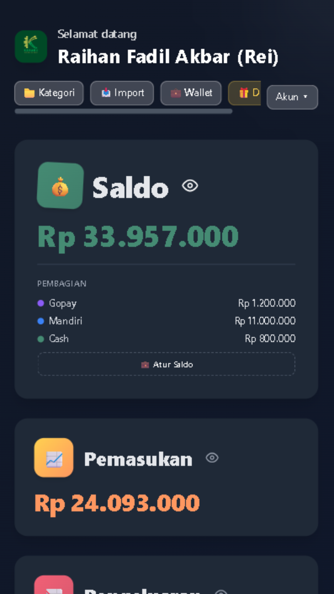

  
  
# Kasaku
  
  **Modern Personal Finance Manager & WhatsApp Bot Integration**
  
  
  
  
  
  
  

  [View Demo](https://kasaku.vercel.app/) • [Report Bug](https://github.com/Zekkenwa/kasaku/issues) • [Request Feature](https://github.com/Zekkenwa/kasaku/issues)

---

## 🚀 Overview

**Kasaku** is a comprehensive personal finance application designed to make money management simple, secure, and accessible. It combines a powerful **Web Dashboard** for detailed analysis with an integrated **WhatsApp Bot** for quick, on-the-go transaction recording.

Built with modern web technologies, Kasaku ensures your data is secure, synchronized in real-time between devices, and presented in a beautiful dark-mode interface.

## ✨ Features

### 💻 Web Dashboard

- **Comprehensive Overview**: Visualize your income, expenses, and net balance with interactive charts.
- **Wallet Management**: Track multiple wallets (Cash, Bank, E-Wallet) and transfer funds between them.
- **Transaction History**: Filterable list of all transactions with category breakdown.
- **Budgeting**: Set monthly budgets for specific categories and track progress.
- **Goal Setting**: Create savings goals and track your contributions.
- **Loan Tracking**: Manage debts and receivables (Hutang & Piutang) with payment history.
- **Recurring Transactions**: Automate regular income/expenses like salaries or subscriptions.

### 🤖 WhatsApp Bot Integration

- **Quick Input**: Record transactions instantly via chat (e.g., `/masuk 50000 Gaji`).
- **Reports**: Get instant daily/monthly financial summaries.
- **Authentication**: Secure OTP login via WhatsApp.
- **Real-time Sync**: Data entered via bot appears instantly on the dashboard.

## � Gallery

  <h3>Web Dashboard</h3>
  

  <h3>Mobile & Features</h3>
  

    
    
    
    
    
    
    
  

## 📜 Syarat & Ketentuan

Dengan menggunakan Kasaku, Anda menyetujui:

1. **Pengumpulan Data**: Kami mengumpulkan data nomor telepon (untuk login) dan informasi keuangan yang Anda input secara sukarela.
2. **Penggunaan Data**: Data hanya digunakan untuk menyediakan layanan pencatatan keuangan pribadi Anda.
3. **Privasi**: Kami **TIDAK** memperjualbelikan data Anda. Privasi adalah prioritas kami.
4. **Hak Pengguna**: Anda memiliki kontrol penuh untuk mengubah atau menghapus data Anda kapan saja.

Selengkapnya dapat dilihat di aplikasi pada menu **Akun > Syarat & Ketentuan** atau [baca kode sumber](app/syarat-ketentuan/page.tsx).

## ☕ Dukungan & Donasi

Jika Anda merasa terbantu dengan **Kasaku**, dukungan Anda sangat berarti untuk pengembangan fitur-fitur baru! Anda bisa mentraktir kami kopi melalui link di bawah ini:

Link Donasi:

- Tako: **[https://tako.id/Zekkenwa](https://tako.id/Zekkenwa)**
- Trakteer: **[https://trakteer.id/zekkenwa](https://trakteer.id/zekkenwa)**

## 🛠️ Tech Stack

- **Framework**: [Next.js 14](https://nextjs.org/)
- **Language**: [TypeScript](https://www.typescriptlang.org/)
- **Styling**: [Tailwind CSS](https://tailwindcss.com/)
- **Database**: [PostgreSQL (Supabase)](https://supabase.com/)
- **ORM**: [Prisma](https://www.prisma.io/)
- **Auth**: [NextAuth.js](https://next-auth.js.org/)
- **Bot Engine**: [@whiskeysockets/baileys](https://github.com/WhiskeySockets/Baileys)

## 📦 Deployment

See the full [Deployment Guide](deployment_guide.md) for detailed instructions.

---

  
Built with ❤️ by <a href="https://github.com/Zekkenwa">Zekkenwa</a>

