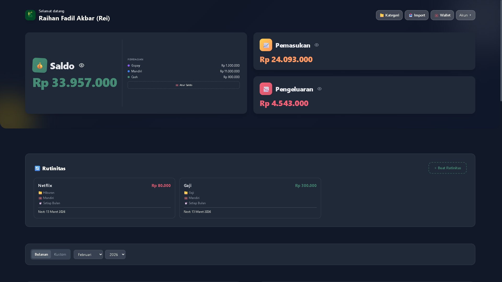
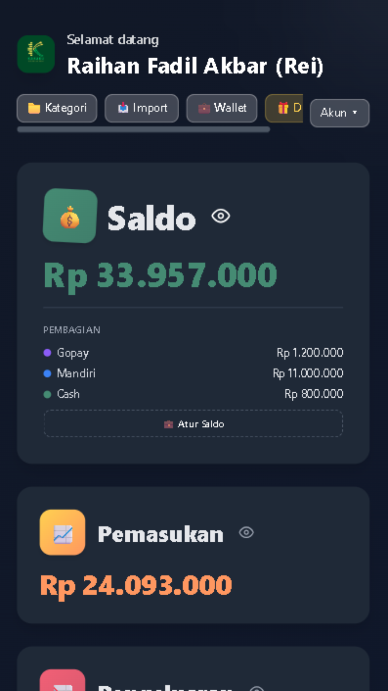

<!-- markdownlint-disable MD033 MD041 MD036 -->

  
  
# Kasaku
  
  **Modern Personal Finance Manager & WhatsApp Bot Integration**
  
  
  
  
  
  
  

  [View Demo](https://kasaku.vercel.app/) • [Report Bug](https://github.com/Zekkenwa/kasaku/issues) • [Request Feature](https://github.com/Zekkenwa/kasaku/issues)

---

## 🚀 Overview

**Kasaku** is a comprehensive personal finance application designed to make money management simple, secure, and accessible. It combines a powerful **Web Dashboard** for detailed analysis with an integrated **WhatsApp Bot** for quick, on-the-go transaction recording.

Built with modern web technologies, Kasaku ensures your data is secure, synchronized in real-time between devices, and presented in a beautiful dark-mode interface.

## ✨ Features

### 💻 Web Dashboard

- **Comprehensive Overview**: Visualize your income, expenses, and net balance with interactive Chart.js charts.
- **Multi-Wallet Management**: Track multiple wallets (Cash, Bank, E-Wallet) with inter-wallet transfers.
- **Transaction History**: Filterable list of all transactions with category breakdown and date range picker.
- **Budgeting**: Set category-based budget limits (Daily, Weekly, Monthly, Yearly) with progress tracking.
- **Goal Setting**: Create savings goals, track contributions, and fund goals from the dashboard or WhatsApp.
- **Loan Tracking**: Manage debts and receivables (Hutang & Piutang) with payment history.
- **Recurring Transactions**: Automate regular income/expenses with cron-based execution.
- **Dark Mode**: Premium dark-mode interface with smooth micro-animations.

### 🤖 WhatsApp Bot (AI-Powered)

- **Natural Language**: Record transactions using everyday Indonesian (e.g., "Makan Padang 35rb pakai GoPay").
- **AI Parsing**: Powered by Google Gemini 2.5 Flash for multi-intent action extraction.
- **Full CRUD**: Create transactions, categories, budgets, debts, goals, and transfers via chat.
- **Wallet-Aware**: Automatically routes transactions to the correct wallet with fuzzy matching.
- **Reports**: Instant daily/monthly financial summaries.
- **OTP Authentication**: Secure WhatsApp-based login and verification.
- **Real-time Sync**: Data entered via bot appears instantly on the dashboard.

### 🏅 Gamification

- **Streak System**: Daily login streaks with freeze day mechanics.
- **20 Badges**: Achievement badges across categories (savings, budgets, goals, AI usage).
- **Health Score**: Financial Health Score calculated from savings rate, budget adherence, debt load, and goals.

### 🔐 Security

- **AES-256-GCM Encryption**: Phone numbers and OAuth tokens encrypted at rest.
- **Blind Indexing (HMAC-SHA256)**: Searchable encrypted fields without exposing plaintext.
- **Category-Isolated OTP Cooldowns**: Independent rate limits per feature (Login, Password, Email, Phone).
- **Account Deletion**: Self-service deletion with 3-day grace period and 1-click cancellation.
- **Automatic Key Caching**: Optimized cryptographic key management for high-traffic environments.

## Gallery

  <h3>Web Dashboard</h3>
  

  <h3>Mobile & Features</h3>
    
    
    
    
    
    
    
  

## 📜 Syarat & Ketentuan

Dengan menggunakan Kasaku, Anda menyetujui:

1. **Pengumpulan Data**: Kami mengumpulkan data nomor telepon (untuk login) dan informasi keuangan yang Anda input secara sukarela.
2. **Penggunaan Data**: Data hanya digunakan untuk menyediakan layanan pencatatan keuangan pribadi Anda.
3. **Fitur AI**: Pesan WhatsApp Anda diproses oleh Google Gemini secara real-time untuk parsing transaksi. Data tidak disimpan oleh Google dan tidak digunakan untuk training model.
4. **Privasi**: Kami **TIDAK** memperjualbelikan data Anda. Privasi adalah prioritas kami.
5. **Hak Pengguna**: Anda memiliki kontrol penuh untuk mengubah atau menghapus data Anda kapan saja.

Selengkapnya dapat dilihat di aplikasi pada menu **Akun > Syarat & Ketentuan** atau [baca kode sumber](app/syarat-ketentuan/page.tsx).

## ☕ Dukungan & Donasi

Jika Anda merasa terbantu dengan **Kasaku**, dukungan Anda sangat berarti untuk pengembangan fitur-fitur baru! Anda bisa mentraktir kami kopi melalui link di bawah ini:

Link Donasi:

- Tako: **[https://tako.id/Zekkenwa](https://tako.id/Zekkenwa)**
- Trakteer: **[https://trakteer.id/zekkenwa](https://trakteer.id/zekkenwa)**

## 🛠️ Tech Stack

- **Framework**: [Next.js 16](https://nextjs.org/)
- **Language**: [TypeScript](https://www.typescriptlang.org/)
- **Styling**: [Tailwind CSS](https://tailwindcss.com/)
- **Database**: [PostgreSQL (Supabase)](https://supabase.com/)
- **ORM**: [Prisma](https://www.prisma.io/)
- **Auth**: [NextAuth.js](https://next-auth.js.org/)
- **AI Engine**: [Google Gemini 2.5 Flash](https://ai.google.dev/)
- **Bot Engine**: [@whiskeysockets/baileys](https://github.com/WhiskeySockets/Baileys)
- **Encryption**: AES-256-GCM + HMAC-SHA256 Blind Indexing
- **Charts**: [Chart.js](https://www.chartjs.org/) + [react-chartjs-2](https://react-chartjs-2.js.org/)

## 📦 Deployment

See the full [Deployment Guide](deployment_guide.md) for detailed instructions.

---

  
Built with ❤️ by <a href="https://github.com/Zekkenwa">Zekkenwa</a>

